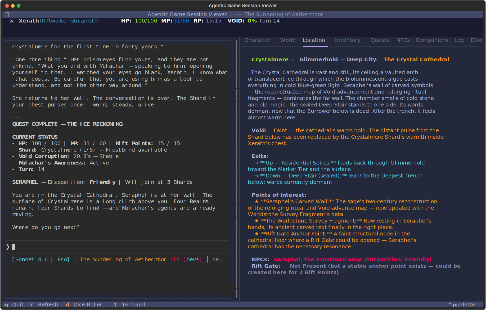

# Agentic Games

A demo repo for creating **agentic games** — text-based games you play by simply *talking* to an AI coding agent.

## What is an Agentic Game?

An agentic game is a game defined entirely by markdown files that you play through conversation with an AI coding assistant. The agent acts as the game engine: it reads the game definition, manages state, enforces rules, narrates the story, and responds to your actions — all through natural language.

No predefined dialogue trees. No fixed choice menus. You say what you want to do, and the agent interprets it, rolls the dice, and tells you what happens. Your choices aren't limited to a list of options — they can be anything you can think of, and they can have unexpected, far-reaching consequences on the story.

Every playthrough is truly unique. The game is created *for you*, shaped *by you*, and experienced *only by you*.

### Compatible Agents

Agentic games work with any AI coding assistant that can read and write files:

- [Claude Code](https://docs.anthropic.com/en/docs/claude-code)
- [Codex](https://github.com/openai/codex)
- [Gemini CLI](https://github.com/google-gemini/gemini-cli)
- [OpenCode](https://github.com/opencode-ai/opencode)
- [Openclaw](https://github.com/AbanteAI/openclaw)
- ...and more

## How to Play

1. Clone this repo (or copy one of the example games into your working directory).
2. Open the game folder in your agent of choice.
3. Tell the agent: **"Read `NEW GAME.md` and follow the instructions."**
4. That's it. You're playing.

To save your progress: tell the agent to read `SAVE GAME.md`.
To resume later: tell the agent to read `LOAD GAME.md`.

## Creating Your Own Game

Creating a customized game is surprisingly simple. Just tell your agent:

> "Read the `game_template.md` file. I want to create a game about [your idea here]."

Give it some specifications — the setting, the tone, the mechanics you want — and it will generate a complete, playable game for you. The [game_template.md](game_template.md) file contains the full specification for the agentic game format, so the agent knows exactly what to build.

## Examples

This repo includes two example games to get you started:

| Game | Description |
|------|-------------|
| [The Sundering of Aethermoor](Examples/The%20Sundering%20of%20Aethermoor/) | A dark fantasy RPG — play as a Riftwalker in a world being torn apart by the Void |
| [Rise of Empires](Examples/Rise%20of%20Empires/) | A civilization-building strategy game — guide your people from humble beginnings to greatness |

An example session of *The Sundering of Aethermoor*:



This game was created simply by telling Claude Code to:
```
read @game_template.md and come up with a good story (something magical, epic) and then create this game. for example, you could use the story of the lord of the rings as a template
```

## Project Structure

```
game_template.md          # The template spec — read this to create new games
Examples/
├── The Sundering of Aethermoor/
│   ├── NEW GAME.md       # Start a new game
│   ├── LOAD GAME.md      # Load a saved game
│   ├── SAVE GAME.md      # Save your progress
│   ├── game/             # World, lore, NPCs, session schema
│   ├── agent/            # Agent behavior rules
│   ├── settings/         # Game configuration
│   ├── tools/            # Python helpers (e.g., dice roller)
│   ├── session/          # Live game state (created at runtime)
│   └── saves/            # Saved playthroughs
└── Rise of Empires/
    └── (same structure)
```

## Why Agentic Games?

Traditional text games give you a fixed set of choices. Agentic games give you a world — and you decide what to do in it. Your actions have real consequences that ripple through the narrative in ways that no one — not even the game's creator — can predict. Every game is a one-of-a-kind story, written live, just for you.

## License

This project is licensed under the [MIT License](LICENSE). Use it, modify it, and build upon it. Go make something fun.
